```mermaid
graph TB
    A[React.js Frontend<br/>TypeScript + Tailwind] --> B[Firebase Authentication<br/>Frontend Login + ID Token]
    B --> C[Django Backend<br/>Token Verification + Route to AI Engine]
    C --> D[OpenRouter API<br/>Cloud Models]
    C --> E[liteLLM Local Gateway<br/>GPU/CPU Local Models]
    
    style A fill:#61DAFB,stroke:#333,stroke-width:2px
    style B fill:#FFCA28,stroke:#333,stroke-width:2px
    style C fill:#092E20,stroke:#333,stroke-width:2px
    style D fill:#4285F4,stroke:#333,stroke-width:2px
    style E fill:#FF6B6B,stroke:#333,stroke-width:2px
```

# 🚀 ALPHA MIND - Intelligent Hybrid AI Chatbot System

<div align="center">

[](https://opensource.org/licenses/MIT)
[](https://www.python.org/)
[](https://reactjs.org/)
[](https://www.djangoproject.com/)
[](https://www.typescriptlang.org/)

**A powerful hybrid AI chat platform that combines cloud AI models (via OpenRouter) with local/offline models (via liteLLM) for fast, cheap, and privacy-focused AI conversations.**

[📖 Documentation](#-documentation) • [🚀 Getting Started](#-getting-started) • [🎯 Features](#-features) • [🏗️ Architecture](#️-architecture)

</div>

---

## ✨ Features

### 🎯 Core Features
- 🔄 **Hybrid AI System**: Switch between cloud (OpenRouter) and local (liteLLM) models
- 🤖 **Multiple AI Models**: GPT-4, Claude 3.5, Gemini, Llama, Grok, Deepseek, and local models
- ⚡ **Streaming Chat**: Real-time responses like ChatGPT
- 🧠 **Smart Routing**: Automatic fallback between cloud and local models
- 📁 **File Analysis**: PDF, Image, Excel upload and analysis
- 💻 **Code Assistant**: Bug fixing, code generation, project structure builder
- 👤 **User System**: Firebase Authentication with profiles and history
- 🌙 **Dark/Light Mode**: Modern UI with theme switching

### 🚀 Advanced Features
- 🎤 **Voice Chat**: Speech → Text & Text → Speech
- 🎨 **Image Generation**: AI-powered image creation
- 📄 **Document Summaries**: Smart document analysis
- 🔍 **Web Search Mode**: Real-time web information
- 🤖 **AI Agents**: Task automation

---

## 🏗️ Architecture



---

## 📁 Project Structure

```
ALPHA MIND/
│
├── 🎨 frontend/           # React.js + TypeScript + Tailwind
│   ├── src/
│   │   ├── components/   # Reusable UI components
│   │   ├── pages/        # Application pages
│   │   ├── hooks/        # Custom React hooks
│   │   ├── utils/        # Utility functions
│   │   └── types/        # TypeScript definitions
│   ├── public/           # Static assets
│   └── package.json       # Dependencies
│
├── 🗄️ backend/            # Django REST Framework
│   ├── alpha_mind/       # Django project settings
│   ├── chat/             # Chat functionality
│   ├── users/            # User management
│   ├── files/            # File upload & analysis
│   ├── gateway/          # AI model gateway
│   └── requirements.txt   # Python dependencies
│
├── 🤖 ai_engine/          # FastAPI AI Engine
│   ├── main.py           # FastAPI app
│   ├── models.py         # Pydantic models
│   ├── services.py       # AI services
│   ├── providers.py      # AI providers
│   └── requirements.txt  # Python dependencies
│
├── 🦾 local-llm/          # liteLLM Configuration
│   ├── liteLLM.yaml      # Configuration file
│   ├── models/           # Local model storage
│   └── scripts/          # Setup scripts
│
├── 📚 docs/               # Documentation
│   ├── api.md            # API documentation
│   ├── deployment.md     # Deployment guide
│   └── setup.md          # Setup instructions
│
└── 📄 README.md           # This file
```

---

## 🛠️ Tech Stack

### 🎨 Frontend
- **React.js** with TypeScript
- **Tailwind CSS** for styling
- **Firebase** for authentication
- **Axios** for API calls
- **React Router** for navigation
- **Zustand** for state management
- **React Query** for data fetching

### 🗄️ Backend
- **Django** with REST Framework
- **Firebase Admin SDK** for token verification
- **OpenRouter API** for cloud models
- **liteLLM** for local models
- **Redis** for caching (optional)

### 🤖 AI Engine
- **FastAPI** for AI model gateway
- **OpenAI** for API compatibility
- **litellm** for local model integration
- **transformers** for local models

---

## 🚀 Getting Started

### 📋 Prerequisites
- Node.js 18+
- Python 3.9+
- Django 4.0+
- Firebase Project
- OpenRouter API Key
- GPU (for local models, optional)

### 🔧 Installation

#### 1️⃣ Clone the repository
```bash
git clone https://github.com/syed-mujtaba-stack/ALPHA-MIND.git
cd ALPHA-MIND
```

#### 2️⃣ Frontend Setup
```bash
cd frontend
npm install
cp .env.example .env.local
# Add Firebase config to .env.local
npm run dev
```

#### 3️⃣ Backend Setup
```bash
cd backend
python -m venv venv
source venv/bin/activate  # Windows: venv\Scripts\activate
pip install -r requirements.txt
cp .env.example .env
# Add API keys to .env
python manage.py migrate
python manage.py runserver
```

#### 4️⃣ AI Engine Setup
```bash
cd ai_engine
pip install -r requirements.txt
cp .env.example .env
# Configure OpenRouter API key
uvicorn main:app --reload
```

#### 5️⃣ Local Models Setup (Optional)
```bash
cd local-llm
pip install litellm
# Configure liteLLM.yaml
# Download local models
```

---

## 🔧 Configuration

### 🌐 Environment Variables

#### 🎨 Frontend (.env.local)
```env
VITE_FIREBASE_API_KEY=your_firebase_api_key
VITE_FIREBASE_AUTH_DOMAIN=your_project.firebaseapp.com
VITE_FIREBASE_PROJECT_ID=your_project_id
VITE_FIREBASE_MESSAGING_SENDER_ID=your_sender_id
VITE_FIREBASE_APP_ID=your_app_id
VITE_API_URL=http://localhost:8000
VITE_AI_ENGINE_URL=http://localhost:4000
```

#### 🗄️ Backend (.env)
```env
SECRET_KEY=your_django_secret_key
DEBUG=True
FIREBASE_PROJECT_ID=your_project_id
OPENROUTER_API_KEY=your_openrouter_key
LITELLM_HOST=http://localhost:4000
DATABASE_URL=sqlite:///db.sqlite3
```

#### 🤖 AI Engine (.env)
```env
OPENROUTER_API_KEY=your_openrouter_api_key_here
LITELLM_HOST=http://localhost:4000
LITELLM_API_KEY=your_litellm_api_key_here
LOCAL_MODEL_PATH=./models
GPU_ENABLED=true
```

---

## 📖 API Documentation

### 🔐 Authentication
- `POST /api/auth/check/` - Verify Firebase token

### 💬 Chat
- `POST /api/chat/send/` - Send chat message
- `GET /api/chat/history/<session_id>/` - Get chat history
- `POST /api/chat/save/` - Save conversation
- `GET /api/chat/sessions/` - List chat sessions

### 🤖 Models
- `GET /api/models/list/` - List available models
- `POST /api/models/switch/` - Switch active model

### 📁 Files
- `POST /api/files/upload/` - Upload file for analysis
- `POST /api/files/analyze/` - Analyze uploaded file
- `GET /api/files/list/` - List uploaded files

---

## 🎯 Usage

1. **🔐 Sign up/login** with Firebase Authentication
2. **🤖 Choose your AI model** from the dropdown
3. **💬 Start chatting** with streaming responses
4. **📁 Upload files** for analysis (PDF, images, Excel)
5. **💻 Switch to code mode** for development assistance
6. **🌐 Enable offline mode** for local model usage

---

## 🤝 Contributing

1. **🍴 Fork** the repository
2. **🌿 Create** a feature branch
3. **💾 Commit** your changes
4. **📤 Push** to the branch
5. **🔀 Open** a Pull Request

---

## 📊 Development Status

### ✅ Completed (Phase 1-2)
- [x] Project structure setup
- [x] Modern React frontend with shadcn/ui
- [x] Django backend with all apps
- [x] FastAPI AI Engine
- [x] Firebase Authentication integration
- [x] Real-time chat interface
- [x] Message history persistence

### 🚧 In Progress (Phase 3)
- [ ] OpenRouter API integration
- [ ] liteLLM local models setup
- [ ] Smart routing implementation
- [ ] Fallback mechanisms

### 📋 Planned (Phase 4-5)
- [ ] File analysis features
- [ ] Voice chat functionality
- [ ] Advanced AI agents
- [ ] Deployment & testing

---

## 📄 License

This project is licensed under the MIT License - see the [LICENSE](LICENSE) file for details.

---

## 🙏 Acknowledgments

- **🤖 OpenRouter** for providing unified AI model access
- **🦾 liteLLM** for local model integration
- **🔥 Firebase** for authentication services
- **🐍 Django Team** for the excellent framework
- **⚡ FastAPI** for modern API development

---

<div align="center">

**🚀 Ready to start building the future of AI chatbots?**

[📖 Documentation](docs/) • [🐛 Report Bug](https://github.com/syed-mujtaba-stack/ALPHA-MIND/issues) • [💡 Feature Request](https://github.com/syed-mujtaba-stack/ALPHA-MIND/issues/new)

Built with ❤️ by the **ALPHA MIND** team

</div>
